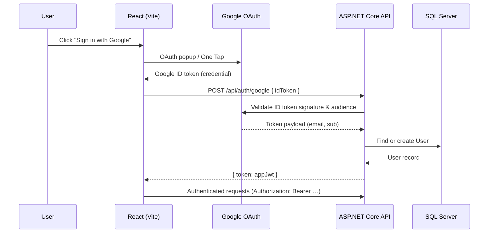

# Eighty-six

A full-stack authentication foundation built with **ASP.NET Core** and **React**. Phase 1 delivers Google OAuth sign-in on the frontend, server-side token verification, user persistence in SQL Server, and issuance of application JWTs for protected API access.

> **Status:** Phase 1 complete — JWT + Google OAuth

---

## Table of contents

- [Overview](#overview)
- [Architecture](#architecture)
- [Tech stack](#tech-stack)
- [Project structure](#project-structure)
- [Prerequisites](#prerequisites)
- [Getting started](#getting-started)
- [Configuration](#configuration)
- [Authentication flow](#authentication-flow)
- [API reference](#api-reference)
- [Database](#database)
- [Roadmap](#roadmap)
- [License](#license)

---

## Overview

Eighty-six is being built in phases. The first phase establishes a secure authentication layer:

- **Google OAuth** on the React frontend via `@react-oauth/google`
- **Server-side validation** of Google ID tokens using `Google.Apis.Auth`
- **User provisioning** — new Google users are created automatically in the database; returning users are looked up by Google subject ID
- **JWT issuance** — after successful OAuth, the backend issues a signed application JWT (HS256) that can be used to authenticate subsequent API requests
- **JWT middleware** — ASP.NET Core validates bearer tokens on protected endpoints

Future phases will extend this foundation with additional auth providers, protected routes, refresh tokens, and application features.

---

## Architecture



```
┌─────────────────────┐         ┌──────────────────────────┐         ┌─────────────┐
│   React Frontend    │  HTTPS  │   ASP.NET Core API       │   EF    │  SQL Server │
│   (localhost:5173)  │ ──────► │   (localhost:5137)       │ ──────► │  AuthAppDb  │
│                     │         │                          │         │             │
│  GoogleOAuthProvider│         │  AuthController          │         │  Users      │
│  GoogleLogin button │         │  tokenService (JWT)      │         │             │
└─────────────────────┘         │  JwtBearer middleware    │         └─────────────┘
                                └──────────────────────────┘
```

---

## Tech stack

| Layer      | Technology |
|------------|------------|
| Backend    | .NET 10, ASP.NET Core Web API |
| Auth       | JWT Bearer (`Microsoft.AspNetCore.Authentication.JwtBearer`), Google token validation (`Google.Apis.Auth`) |
| Database   | Entity Framework Core 10, SQL Server (LocalDB for local dev) |
| Frontend   | React 19, TypeScript, Vite 8 |
| OAuth UI   | `@react-oauth/google` |
| HTTP       | Axios |

---

## Project structure

```
Eighty-six/
├── NetProject/                    # ASP.NET Core backend
│   ├── Controllers/
│   │   └── ValuesController.cs    # AuthController — Google OAuth endpoint
│   ├── Models/
│   │   └── User.cs                # User entity
│   ├── Repository/
│   │   └── AppDbContext.cs        # EF Core DbContext
│   ├── Services/
│   │   └── tokenService.cs        # JWT generation
│   ├── Migrations/                # EF Core database migrations
│   ├── Program.cs                 # App bootstrap, CORS, JWT middleware
│   └── appsettings.json           # Configuration (use secrets in prod)
│
├── frontend/                      # React + Vite SPA
│   ├── src/
│   │   ├── App.tsx                # Google sign-in UI
│   │   └── main.tsx               # GoogleOAuthProvider setup
│   └── .env                       # VITE_* environment variables
│
├── NetProject.slnx
├── LICENSE
└── README.md
```

---

## Prerequisites

Before running the project locally, make sure you have:

| Tool | Version / notes |
|------|-----------------|
| [.NET SDK](https://dotnet.microsoft.com/download) | 10.x |
| [Node.js](https://nodejs.org/) | 20+ recommended |
| SQL Server | [LocalDB](https://learn.microsoft.com/en-us/sql/database-engine/configure-windows/sql-server-express-localdb) (included with Visual Studio) or a full SQL Server instance |
| Google Cloud project | OAuth 2.0 **Web application** client ID |

### Google OAuth setup

1. Go to [Google Cloud Console](https://console.cloud.google.com/) → **APIs & Services** → **Credentials**.
2. Create an **OAuth 2.0 Client ID** of type **Web application**.
3. Add authorized JavaScript origins:
   - `http://localhost:5173` (Vite dev server)
4. Copy the **Client ID** — you will need it for both backend and frontend configuration.

---

## Getting started

### 1. Clone the repository

```bash
git clone https://github.com/<your-username>/Eighty-six.git
cd Eighty-six
```

### 2. Configure the backend

Update `NetProject/appsettings.json` (or use [User Secrets](https://learn.microsoft.com/en-us/aspnet/core/security/app-secrets) for local development):

```json
{
  "JwtSettings": {
    "Secret": "<your-256-bit-secret-key>",
    "Issuer": "AuthService",
    "Audience": "AuthServiceUsers",
    "ExpiryInMinutes": 60
  },
  "GoogleSettings": {
    "ClientId": "<your-google-client-id>.apps.googleusercontent.com"
  },
  "ConnectionStrings": {
    "DefaultConnection": "Server=(localdb)\\mssqllocaldb;Database=AuthAppDb;Trusted_Connection=True;TrustServerCertificate=True;"
  }
}
```

> **Security note:** Do not commit real secrets to source control. Prefer `dotnet user-secrets`, environment variables, or a secrets manager for production.

Apply database migrations:

```bash
cd NetProject
dotnet ef database update
```

Run the API:

```bash
dotnet run
```

The API starts at **http://localhost:5137** by default (see `Properties/launchSettings.json`).

### 3. Configure the frontend

Create `frontend/.env`:

```env
VITE_GOOGLE_CLIENT_ID=<your-google-client-id>.apps.googleusercontent.com
VITE_BACKEND_URL=http://localhost:5137
```

Install dependencies and start the dev server:

```bash
cd frontend
npm install
npm run dev
```

The frontend runs at **http://localhost:5173**.

### 4. Verify it works

1. Open `http://localhost:5173` in your browser.
2. Click the Google sign-in button and authenticate.
3. On success, the issued application JWT appears in the UI.
4. Optionally hit the health endpoint:

```bash
curl http://localhost:5137/api/auth/test
```

Expected response:

```json
{ "message": " Server is running and up " }
```

---

## Configuration

### Backend (`appsettings.json`)

| Key | Description |
|-----|-------------|
| `JwtSettings:Secret` | Symmetric key used to sign and validate JWTs (HS256) |
| `JwtSettings:Issuer` | Token issuer claim (`iss`) |
| `JwtSettings:Audience` | Token audience claim (`aud`) |
| `JwtSettings:ExpiryInMinutes` | Token lifetime in minutes |
| `GoogleSettings:ClientId` | Google OAuth client ID — used to validate ID token audience |
| `ConnectionStrings:DefaultConnection` | SQL Server connection string |

### Frontend (`.env`)

| Variable | Description |
|----------|-------------|
| `VITE_GOOGLE_CLIENT_ID` | Same Google OAuth client ID as the backend |
| `VITE_BACKEND_URL` | Base URL of the ASP.NET Core API |

### CORS

The backend allows requests from `http://localhost:5173` (configured in `Program.cs`). Update the CORS policy when deploying to other origins.

---

## Authentication flow

### Google sign-in → application JWT

1. The user signs in with Google on the React frontend.
2. Google returns an **ID token** (JWT) to the client.
3. The frontend sends the ID token to `POST /api/auth/google`.
4. The backend validates the token with Google's libraries:
   - Signature verification
   - Audience matches `GoogleSettings:ClientId`
   - Token is not expired
5. The backend extracts `email` and `sub` (Google subject ID) from the payload.
6. If no user exists with that `GoogleSubjectId`, a new `User` row is inserted.
7. The backend generates an application JWT containing `sub`, `email`, and `jti` claims.
8. The JWT is returned to the frontend as `{ "token": "..." }`.

### Using the JWT on protected endpoints

Send the token in the `Authorization` header:

```
Authorization: Bearer <your-jwt>
```

ASP.NET Core's JWT Bearer middleware (configured in `Program.cs`) validates the token on endpoints decorated with `[Authorize]`.

---

## API reference

### `GET /api/auth/test`

Health check — confirms the API is running. No authentication required.

**Response `200 OK`**

```json
{
  "message": " Server is running and up "
}
```

---

### `POST /api/auth/google`

Exchange a Google ID token for an application JWT.

**Request body**

```json
{
  "idToken": "<google-id-token>"
}
```

**Response `200 OK`**

```json
{
  "token": "<application-jwt>"
}
```

**Response `401 Unauthorized`**

```
Invalid or expired Google Token.
```

---

## Database

### User model

| Column | Type | Notes |
|--------|------|-------|
| `id` | `Guid` | Primary key |
| `Email` | `string` | Unique index |
| `GoogleSubjectId` | `string?` | Indexed — Google `sub` claim |
| `PasswordHash` | `string?` | Reserved for future email/password auth |
| `AuthProvider` | `string` | Defaults to `"Google"` |
| `CreatedAt` | `DateTime` | UTC timestamp |

### Migrations

```bash
# Apply migrations
dotnet ef database update --project NetProject

# Create a new migration after model changes
dotnet ef migrations add <MigrationName> --project NetProject
```

---

## Roadmap

Phase 1 is complete. Planned next steps:

| Phase | Feature | Status |
|-------|---------|--------|
| **1** | Google OAuth + JWT issuance & validation | ✅ Complete |
| **2** | Protected API endpoints with `[Authorize]` | 🔲 Planned |
| **3** | Refresh tokens / token rotation | 🔲 Planned |
| **4** | Additional auth providers (GitHub, Microsoft, etc.) | 🔲 Planned |
| **5** | Email/password registration & login | 🔲 Planned |
| **6** | Frontend auth state, route guards, token storage | 🔲 Planned |
| **7** | Production deployment & CI/CD | 🔲 Planned |

---

## Development scripts

### Backend

```bash
cd NetProject
dotnet run              # Start API
dotnet build            # Build
dotnet ef database update   # Apply migrations
```

### Frontend

```bash
cd frontend
npm run dev             # Start Vite dev server
npm run build           # Production build
npm run lint            # Run oxlint
npm run preview         # Preview production build
```

---

## License

This project is licensed under the [MIT License](LICENSE).

Copyright (c) 2026 Tibo
